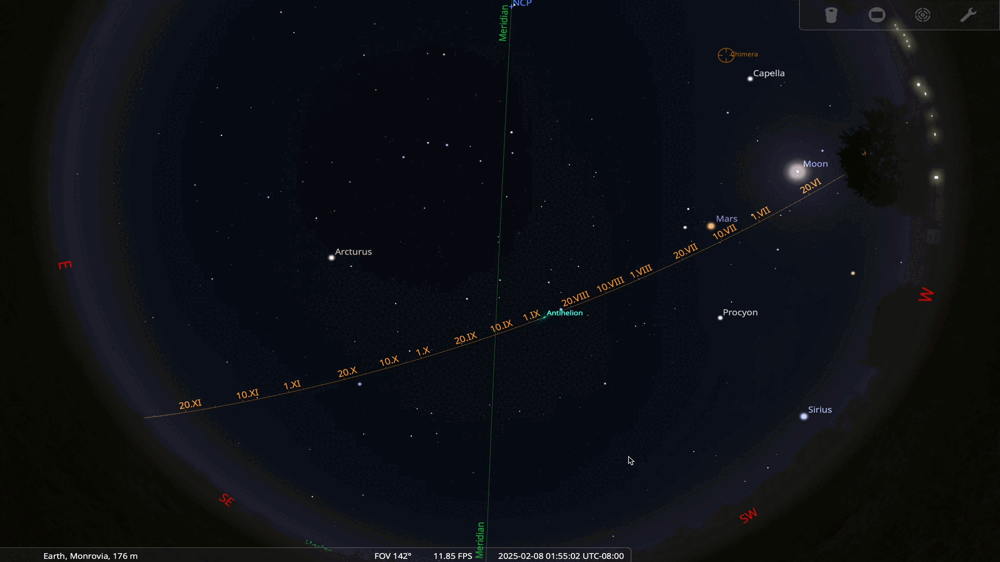

# chimera-stellarium plugin

A [chimera](https://www.github.com/astroufsc/chimera/) controller plugin
to integrate with [Stellarium](http://www.stellarium.org/).



## Installation

To install this plugin, just run:

    pip install -U git+https://github.com/astroufsc/chimera-stellarium.git

## Chimera Configuration

On the chimera side, just install the plugin and add a controller of
`Stellarium` type.

```yaml
    controller:
        - type: Stellarium
        name: stellarium
        telescope: /FakeTelescope/fake   # Optional, if you have only one telescope.
        position_update_frequency: 0.5   # Optional, times per second. Default: 2 Hz.
        host: localhost                  # Host/ip to listen for new connections. Default: localhost
        port: 10001                      # Port to listen for new connections. Default: 10001
```

## Stellarium Configuration

On [Stellarium](http://www.stellarium.org/), you should follow the steps
to add a telescope.

- Open the Configuration window (press F2);
- Go to the Plugin tab;
- Select "Telescope Control" from the list;
- Check the "Load at startup" option;
- Exit Stellarium. Open it again;
- Back on the Telescope Control tab under Configuration window, click configure, then on Add;
- Select External Software type, choose a name (e.g. `chimera`) it and set the coordinates to J2000. Optionally set to start/connect at startup.


- Then, skip device settings tab and type the connection settings with the host (which by default is `localhost`) and the port (which by default is `10001`).


- Click on connect and, if successful, you should see the `Connected` status on the telescopes dialog:


- To move the telescope, go to the main window, select the desired star and press CRTL+0, which is the shortcut for the first configured telescope. Select current object or to slew to the selected object and then in Slew.


- You should see where your telescope is pointing to on the Stellarium
    sky-map.


For more info on setting up the connection: <http://www.stellarium.org/wiki/index.php/Telescope_Control_plug-in>

## Contact

For more information, contact us on chimera's discussion list: <https://groups.google.com/forum/#!forum/chimera-discuss>

Bug reports and patches are welcome and can be sent over our GitHub page: <https://github.com/astroufsc/chimera-stellarium/>
